# No Drink No Life

This is a water drink reminding App combined with a stickman life simulation and past seven days statistics.

## Features

* Tutorial on the first time
* Notify user to drink water between a period set by the user
* Simulate the life of a stickman according to the amount of water user drank
* Show the record of the user’s drinking water frequency in the last two weeks
* Come in two languages (Traditional Chinese and English)

## Getting Started

The following guide will help you download the project to the local machine, compile, and run it.

### Prerequisites

* Android Studio
* Android device / AVD

### Installing

1.  Clone or download the project as zip from GitHub.
2.  From the Android Studio menu click File > New > Import Project.
3.  Skip the Gradle update reminder.
4.  Install missing platform and sync project if prompt.
5.  Run.

## Screenshots
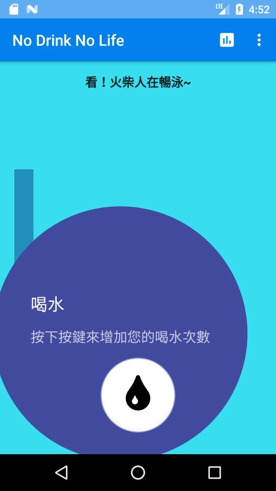
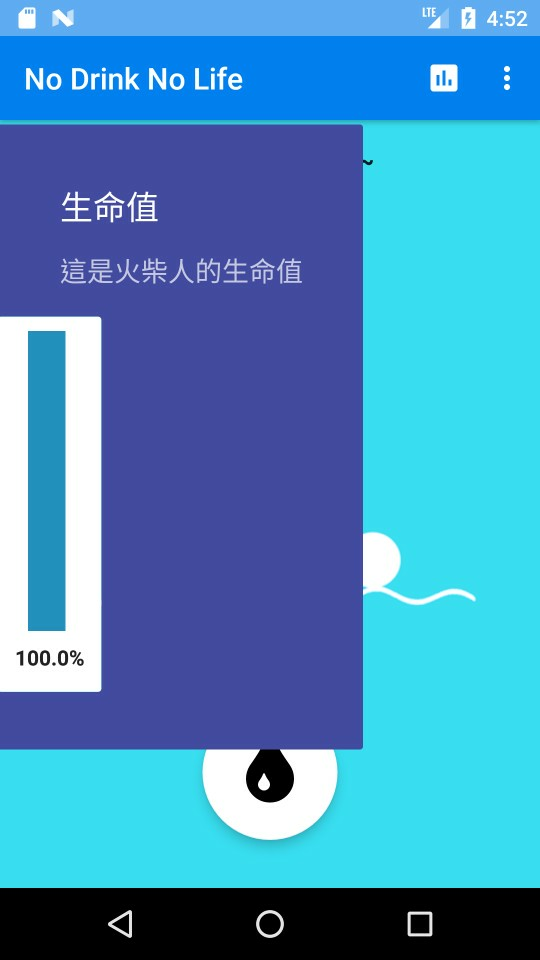
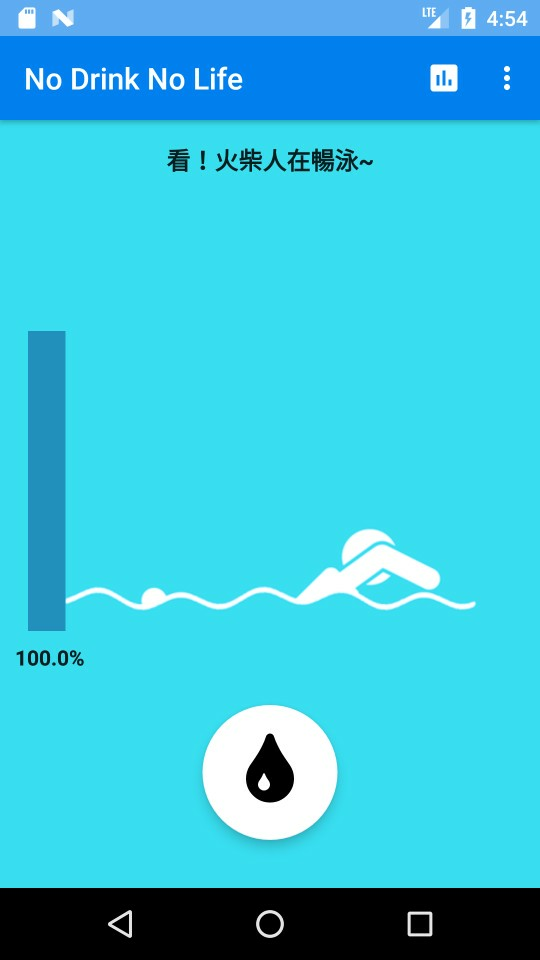
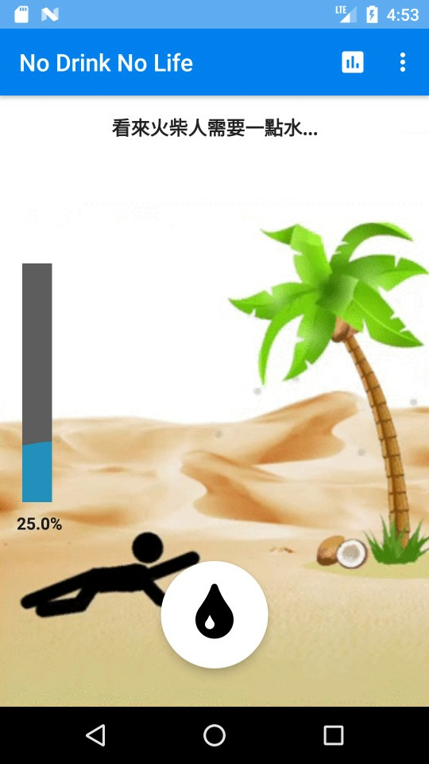
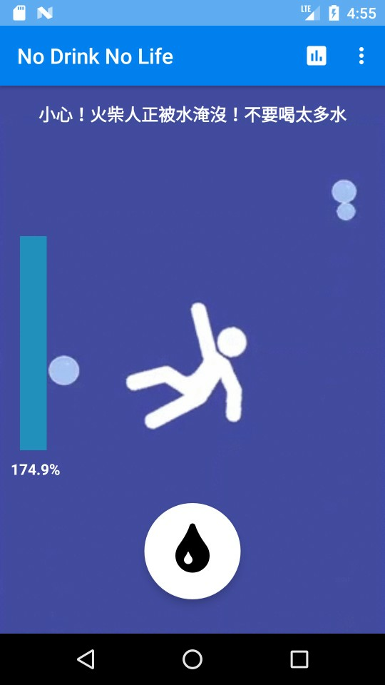
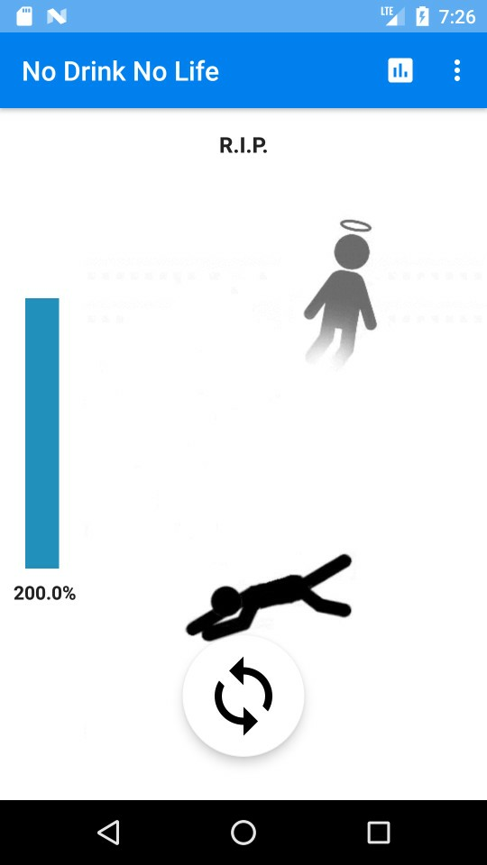
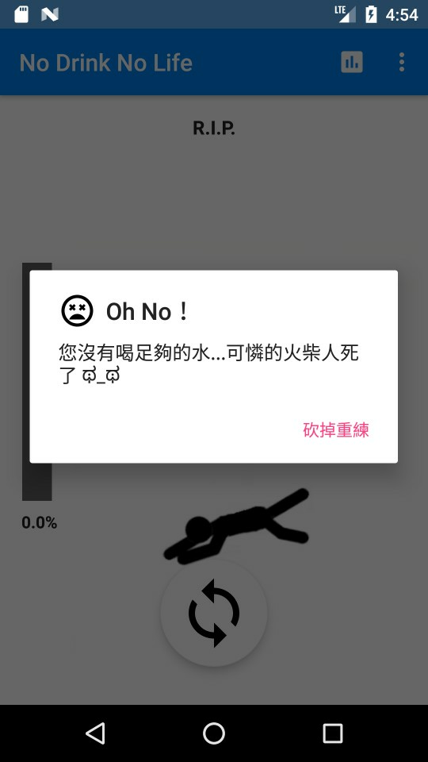
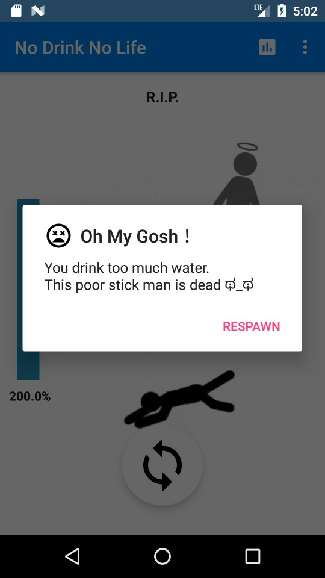
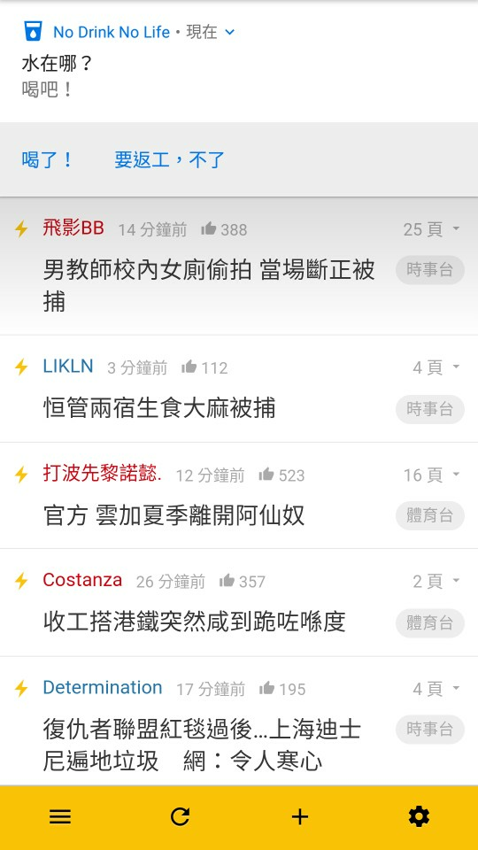
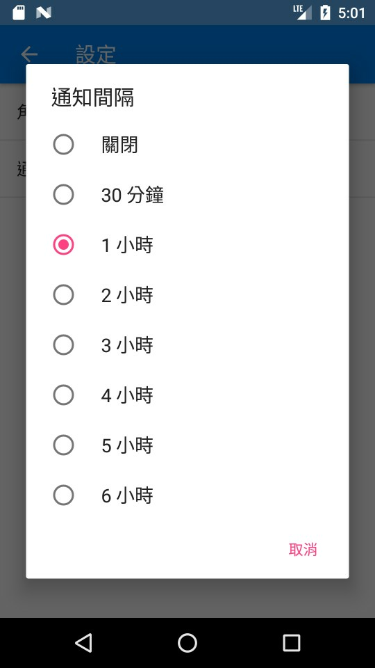
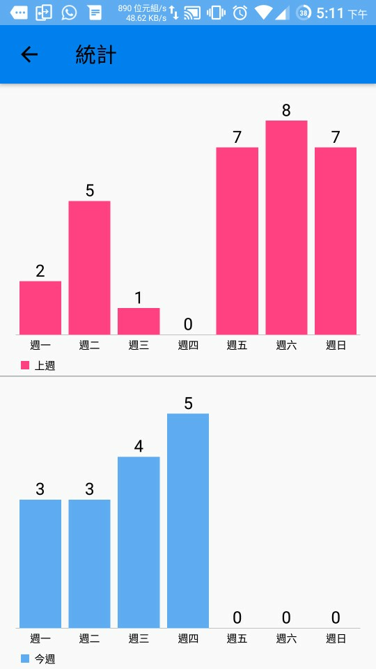

## Authors

* **Kiros Choi** - *Initial work* - [KirosC](https://github.com/KirosC)

## Acknowledgement

* Cheung Cheuk Yiu - Design the animations
* [android-gif-drawable](https://github.com/koral--/android-gif-drawable) - Display GIF images
* [WaveLoading](https://github.com/race604/WaveLoading) - A wave-like loading drawable
* [MPAndroidChart](https://github.com/PhilJay/MPAndroidChart) - Chart view
* [MaterialTapTargetPrompt](https://github.com/sjwall/MaterialTapTargetPrompt) - Material Design Onboarding guidelines
